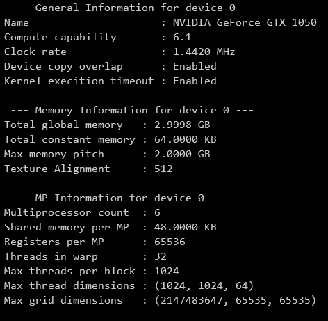
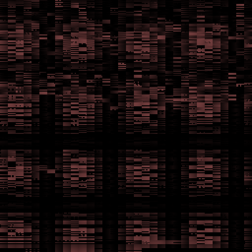
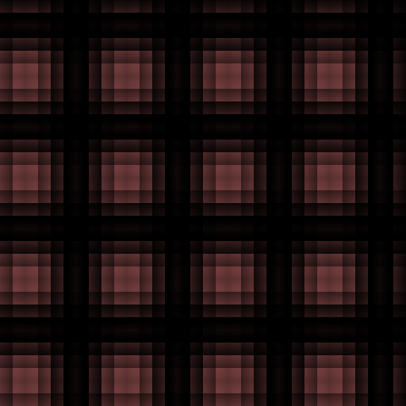

# cudaFiles
Repo for CUDA files.
This repo has been built and tested in Windows, in the following configuration:

* **CMake:** v3.22
* **Device Name:** NVIDIA GeForce GTX 1050
* **Compute Capability:** 6.1
* **CUDA Architecture:** 60 (compute_60, sm_60)
* **CUDA:** v11.6

## Prerequisites
* [CMake](https://cmake.org/download/)
* [CUDA runtime library](https://developer.nvidia.com/cuda-downloads) 

## Configuration
Configure cmake build files.\
(Run these commands in the root directory of this repo.)
### For Windows
```
./config.bat
```

## Build and run
(Run these commands in the root directory of this repo.)
### For Windows
Build and run in Debug mode.
```
./build.bat
./run.bat
```

Build and run in Release mode.
```
./build-rel.bat
./run-rel.bat
```

## Output
Some screenshots of the outputs of the programs.

<!--* write image caption

-->

* Device query output



* Grayscale


* Gradient image


* Shared memory `__syncthreads()` visualization 

without `__syncthreads()`                                   | with `__syncthreads()`
:-:                                               |:-:
 | 

## Resources
* [CUDA C++ Programming Guide](https://docs.nvidia.com/cuda/cuda-c-programming-guide/index.html)
* [NVCC commands manual](https://helpmanual.io/help/nvcc/)
* [CUDA - Modern CMake](https://cliutils.gitlab.io/modern-cmake/chapters/packages/CUDA.html)
* [Building Cross-Platform CUDA Applications with CMake](https://developer.nvidia.com/blog/building-cuda-applications-cmake/)
* [CUDA by Example](https://developer.nvidia.com/cuda-example)
* [CUDA Memory model](https://www.3dgep.com/cuda-memory-model/)